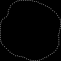

# Edge Detector

Javascript app which takes image files as input and outputs coordinates of transparency edge points, together with preview of those edge points. 

## Table of Contents

[⚓General Informations](#general-informations)

[⚓Technologies](#technologies)

[⚓Usage](#usage)

[⚓License](#license)

## General Informations

Purpose of this app is to find coordinates of transparency edge points in images. It was used to define image collision points in game that i was building for my portfolio website.

## Technologies

<a href="https://developer.mozilla.org/en-US/docs/Web/JavaScript">  Javascript</a> - programming language that is one of the core technologies of the World Wide Web.

<a href="https://www.npmjs.com/package/pngjs">  Pngjs</a> - simple PNG encoder/decoder for Node.js with no dependencies.

## Usage

- Clone repository:
   
```sh 
git clone https://github.com/rafJagCode/edge_detector.git
```

- Install dependencies:

```sh
cd edge_detector
npm install
```

- Copy image you want to process inside __images__ folder


- Run script using nodejs:

```sh
node index.js
```

- In __output_js__ folder you will have a js file with edge points coordinates

```js
// x and y are collision points coordinates in % of width and height of image

const imagesCollisionData = {
  'asteroid-whole-1': [
    { x: 0.97, y: 0.49 },
    { x: 0.98, y: 0.46 },
    { x: 0.99, y: 0.43 },
    { x: 0.99, y: 0.4 },
    { x: 0.99, y: 0.37 },
    { x: 0.99, y: 0.34 },
    { x: 0.98, y: 0.31 },
    { x: 0.96, y: 0.28 },
    { x: 0.94, y: 0.25 },
    { x: 0.92, y: 0.22 },
    { x: 0.89, y: 0.19 },
    { x: 0.86, y: 0.17 },
    { x: 0.83, y: 0.14 },
    { x: 0.8, y: 0.12 },
    { x: 0.77, y: 0.1 },
    { x: 0.74, y: 0.09 },
    { x: 0.71, y: 0.07 },
    { x: 0.68, y: 0.06 },
    { x: 0.65, y: 0.05 },
    { x: 0.62, y: 0.03 },
    { x: 0.59, y: 0.02 },
    { x: 0.56, y: 0.02 },
    { x: 0.53, y: 0.01 },
    { x: 0.5, y: 0 },
    { x: 0.47, y: 0 },
    { x: 0.44, y: 0 },
    { x: 0.41, y: 0 },
    { x: 0.38, y: 0 },
    { x: 0.35, y: 0 },
    { x: 0.32, y: 0 },
    { x: 0.29, y: 0.01 },
    { x: 0.26, y: 0.02 },
    { x: 0.23, y: 0.04 },
    { x: 0.2, y: 0.06 },
    { x: 0.17, y: 0.09 },
    { x: 0.16, y: 0.12 },
    { x: 0.14, y: 0.15 },
    { x: 0.13, y: 0.18 },
    { x: 0.13, y: 0.21 },
    { x: 0.12, y: 0.24 },
    { x: 0.1, y: 0.27 },
    { x: 0.07, y: 0.29 },
    { x: 0.04, y: 0.31 },
    { x: 0.02, y: 0.34 },
    { x: 0.01, y: 0.37 },
    { x: 0, y: 0.4 },
    { x: 0, y: 0.43 },
    { x: 0, y: 0.46 },
    { x: 0, y: 0.49 },
    { x: 0, y: 0.52 },
    { x: 0, y: 0.55 },
    { x: 0, y: 0.58 },
    { x: 0, y: 0.61 },
    { x: 0, y: 0.64 },
    { x: 0.01, y: 0.67 },
    { x: 0.02, y: 0.7 },
    { x: 0.04, y: 0.73 },
    { x: 0.07, y: 0.76 },
    { x: 0.1, y: 0.79 },
    { x: 0.13, y: 0.82 },
    { x: 0.16, y: 0.85 },
    { x: 0.19, y: 0.87 },
    { x: 0.22, y: 0.89 },
    { x: 0.25, y: 0.91 },
    { x: 0.28, y: 0.91 },
    { x: 0.31, y: 0.92 },
    { x: 0.34, y: 0.92 },
    { x: 0.37, y: 0.93 },
    { x: 0.4, y: 0.94 },
    { x: 0.43, y: 0.96 },
    { x: 0.46, y: 0.97 },
    { x: 0.49, y: 0.98 },
    { x: 0.52, y: 0.99 },
    { x: 0.55, y: 0.99 },
    { x: 0.58, y: 0.99 },
    { x: 0.61, y: 0.99 },
    { x: 0.64, y: 0.98 },
    { x: 0.67, y: 0.97 },
    { x: 0.7, y: 0.96 },
    { x: 0.73, y: 0.94 },
    { x: 0.76, y: 0.93 },
    { x: 0.79, y: 0.91 },
    { x: 0.82, y: 0.89 },
    { x: 0.85, y: 0.87 },
    { x: 0.88, y: 0.85 },
    { x: 0.91, y: 0.82 },
    { x: 0.93, y: 0.79 },
    { x: 0.94, y: 0.76 },
    { x: 0.96, y: 0.73 },
    { x: 0.96, y: 0.7 },
    { x: 0.96, y: 0.67 },
    { x: 0.96, y: 0.64 },
    { x: 0.96, y: 0.61 },
    { x: 0.95, y: 0.58 },
    { x: 0.96, y: 0.55 },
    { x: 0.97, y: 0.52 },
  ],
};

export default imagesCollisionData;

```

- In __edge_previevs__ folder you can see image with marked edge points



## License

MIT


[javascript]: <https://developer.mozilla.org/en-US/docs/Web/JavaScript?retiredLocale=pl>
[pngjs]: <https://www.npmjs.com/package/pngjs>
